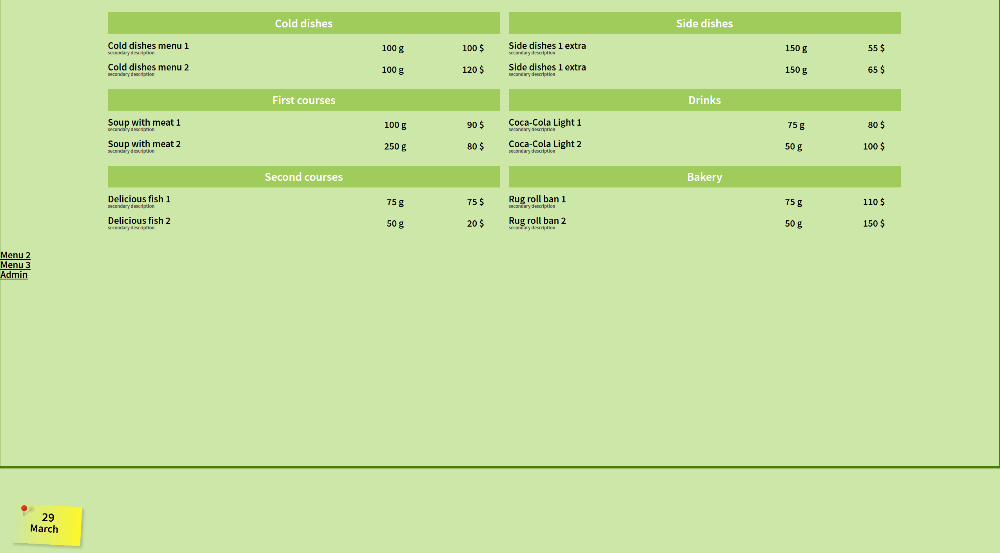

 ► ON-SCREEN FOOD MENU FOR RESTAURANTS  
 Brief project description.  

Beta stage. No design, just a concept.  
Functionality for entering dishes into the database is under development.  

>> NEW Added PHP logic to add products to the database, remove element by their ID value, list all available products on one page.
Currently, the application does not have a responsive design because it is intended to be used on 1920x1080 environment.

Dashboard > adds dishes to the DB, removes dishes by ID, lists all available products
Today menu > lists all today's dishes [TBD]
All dishes > parses DB for all available dishes
 

Project implements solution for a dinning menu generation,   
where data are taken from PostgreSQL database via PHP script.  
On frontend side data is received by means of pure Javascript.  
Webpack environment is used for a frontend foundation.  
PUG syntax is used instead of plain HTML.  
   
► TECHNOLOGY STACK  
Developed on Windows 7 x64 ESU  

FRONTEND SIDE  
#############  
PUG markup/Js  
NodeJs 23.7  
Webpack 5.88  
VS Code 1.93  

BACKEND SIDE  
############  
XAMPP [for making PHP 8 work on Windows 7]  
Apache [embedded version]  
PHP 8.2  
PostgreSQL 14  
PGAdmin 6.21 [hacked]  

> See plain [[_readme.txt]](_readme.txt) for more details.
