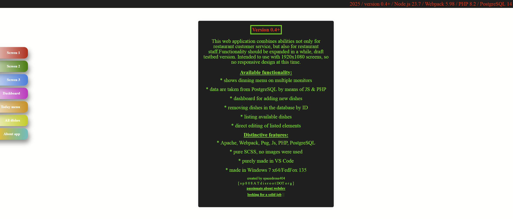

► ON-SCREEN FOOD MENU FOR RESTAURANTS  
Brief project description.

Beta stage. No design, just a concept.  
Move the application to a platform like Heroku [TBD]   
to get a live preview of the software to train myself as a developer.  

Project implements solution for a dinning menu generation,  
where data are taken from PostgreSQL database via PHP script.  
On frontend side data is received by means of pure Javascript.  
Webpack environment is used for a frontend foundation.  
PUG syntax is used instead of plain HTML.

► DISTINCTIVE FEATURES  
####################

* wide range of technologies used
* pure SCSS, no images were used
* purely made in VS Code
* made in Windows 7 x64 ESU/RedFox 135

► TECHNOLOGY STACK  
###################

FRONTEND SIDE  

PUG markup/SCSS  
JavaScript/NodeJs 23.7  
Webpack 5.98  
VS Code 1.93 (hacked)

BACKEND SIDE  

XAMPP (for making PHP 8 work on Windows 7)  
Apache (embedded version)
PHP 8.2  
PostgreSQL 14  
PGAdmin 6.21 (hacked)

> See plain [[_readme.txt]](\_readme.txt) for more details.
